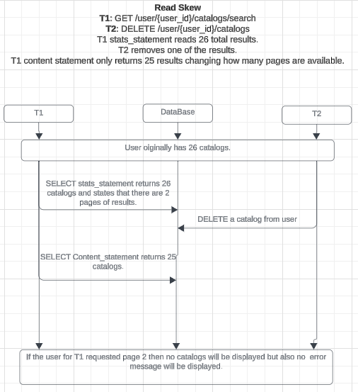
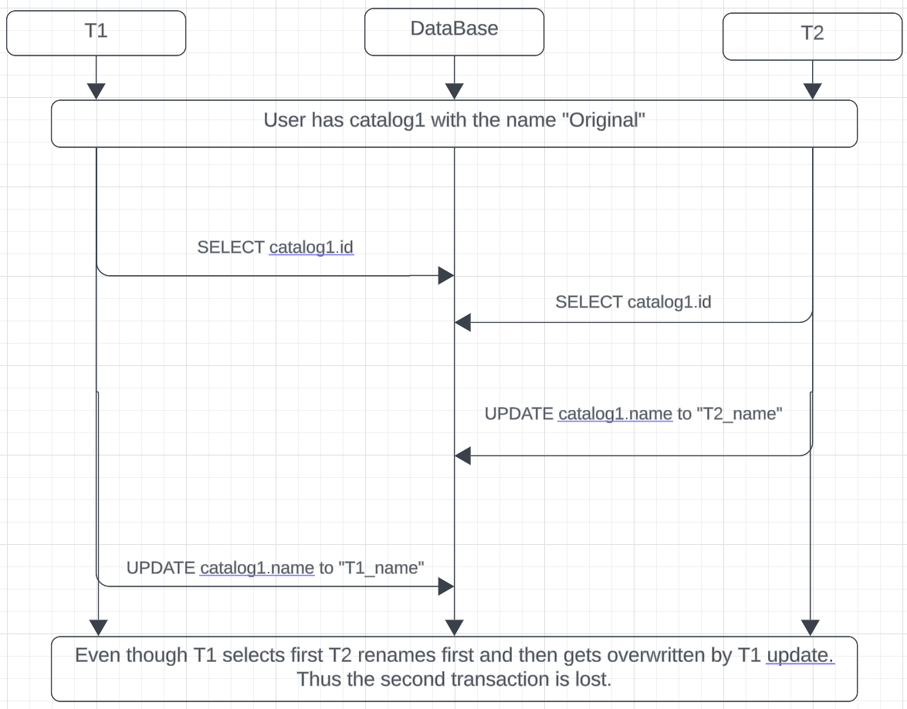
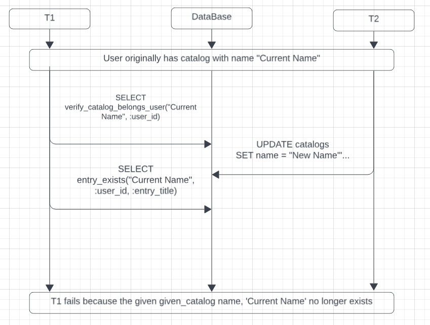

## Case 1: Read Skew -***maybe***- Non Repeatable Read
**T1**: ```GET /users/{user_id}/catalogs?page=2&order_by=name&direction=asc``` \
**T2**: ```DELETE /users/{user_id}/catalogs/{catalog_id}```\

### Solution:
- Using a repeatable read isolation level will allow T1 to read twice and get consistent results. Thus T1 will have no knowlage of the delete.

## Case 2: Lost Update
**T1** ```PUT /users/{user_id}/catalogs/{catalog_id}```\
**T2** ```PUT /users/{user_id}/catalogs/{catalog_id}```

### Solution:
- Using a serializable isolation level will prevent any changes to be done by T2 before T1 is done.

## Case 3: Phantom Read
**T1** ```POST /users/{user_id}/catalogs/{catalog_name}/game-entries```\
**T2** ```DELETE /users/{user_id}/catalogs/{catalog_id}```\

### Solution:
- Using a serializable isolation level will prevent any changes from being made by T2 before T1 is done.
